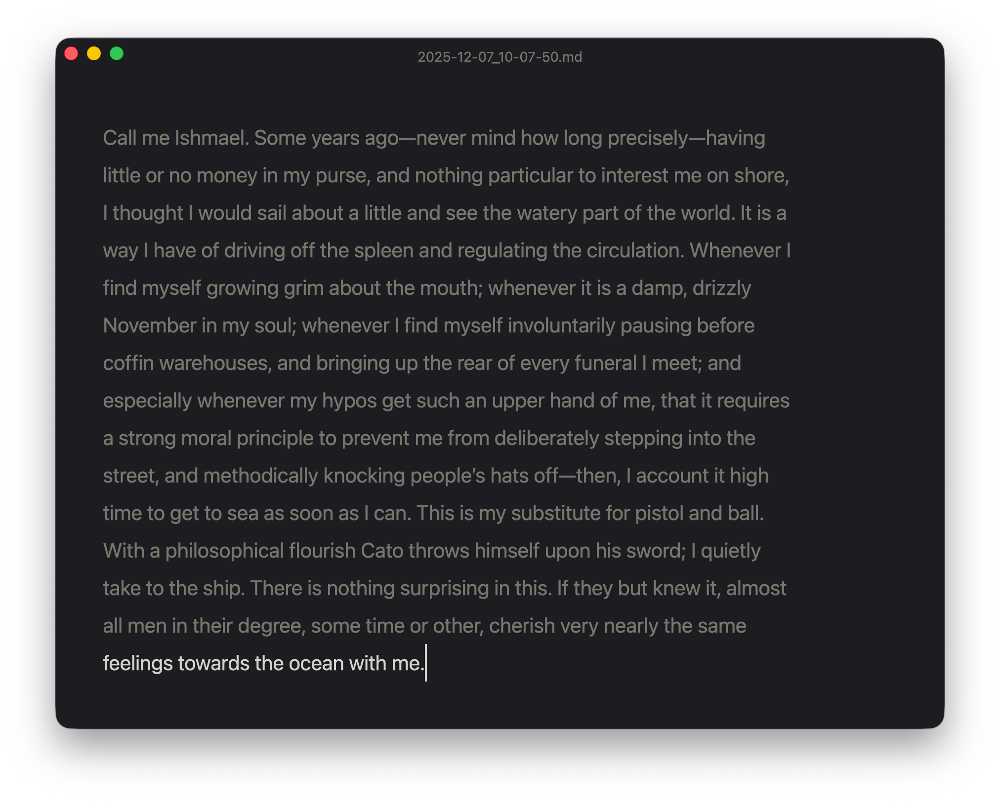
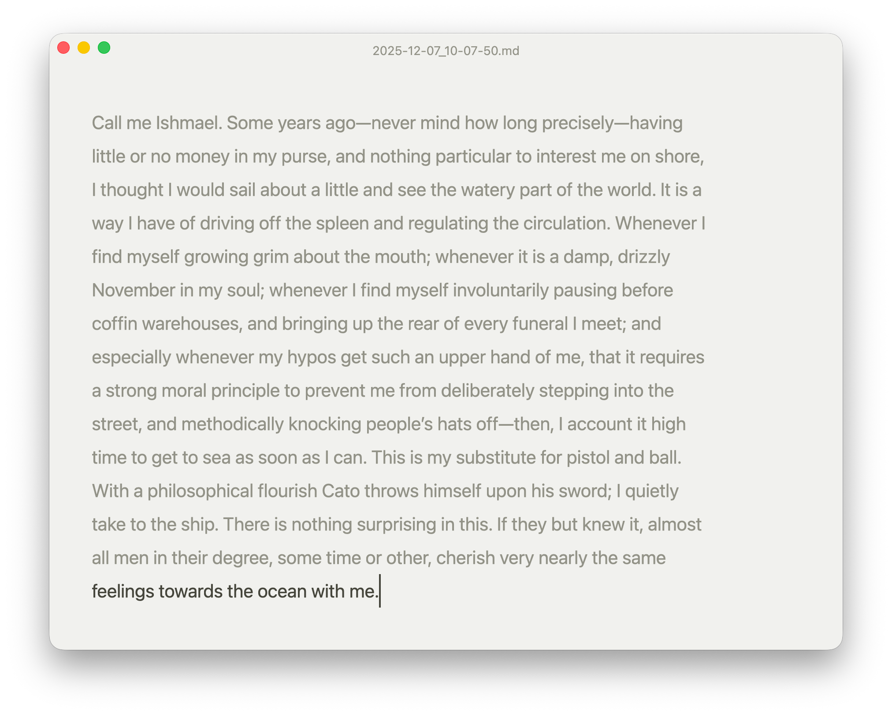
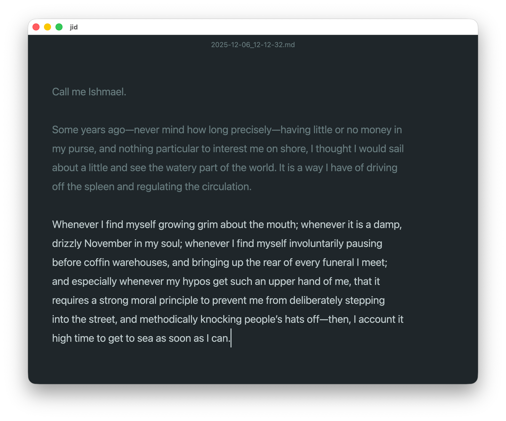
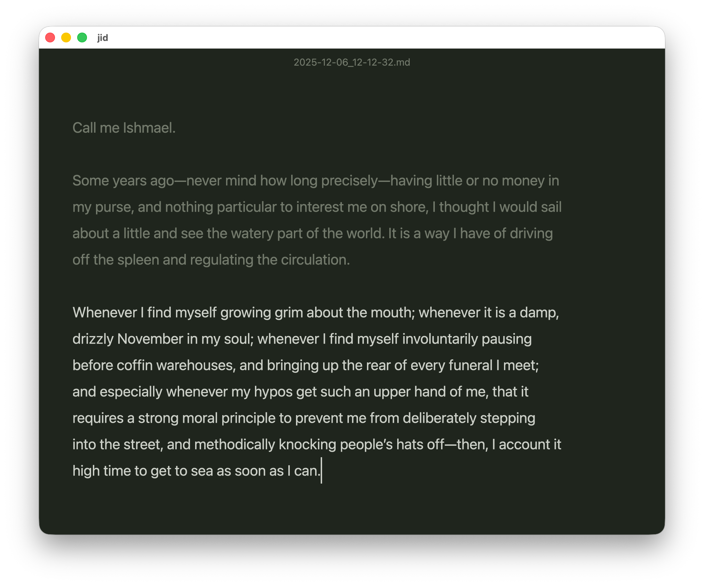
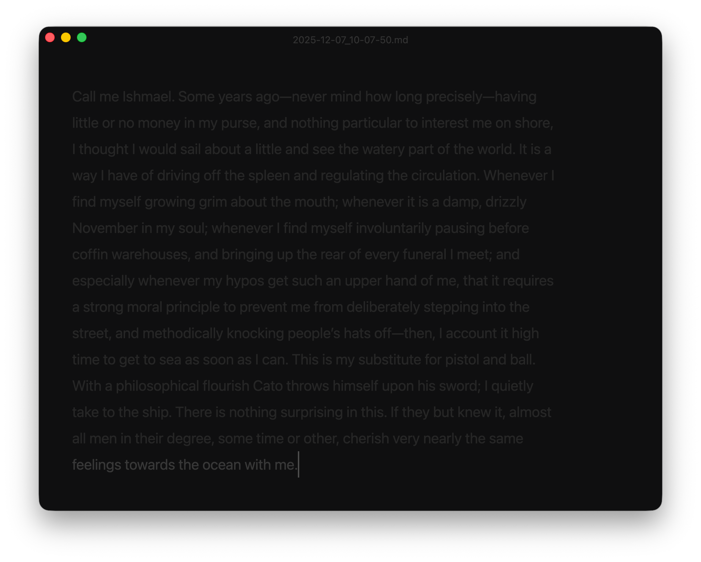

# `jid` (`j`ot `i`t `d`own)

A distraction-free writing app built with [GPUI](https://www.gpui.rs/).

## What it does

`jid` is a minimal text editor for focused writing. No menus, no toolbars—just a centered editor and your words.

- **Auto-save** — Documents save automatically to `~/Documents/jid/`
- **Multiple themes** — Cycle through themes with `Cmd+Shift+T`
- **Focus mode** — Dims all lines except the current one for distraction-free writing
- **Keyboard-first** — All actions via shortcuts

## Installation

```
cargo install jotitdown
```

Then run with:

```
jid
```

To create a macOS app bundle (launchable from Spotlight/Finder):

```
curl -sSL https://raw.githubusercontent.com/ehamiter/jid/main/make_app.sh | bash
```

## Building from Source

```
cargo run
```

To build a macOS app bundle:

```
./build_app.sh
cp -r target/release/jid.app /Applications/
```

## Keyboard Shortcuts

| Action | Shortcut |
|--------|----------|
| Save | `Cmd+S` |
| Cycle theme | `Cmd+Shift+T` |
| Toggle focus mode | `Cmd+.` |
| Open config | `Cmd+,` |
| Quit | `Cmd+Q` |

## Themes

Cycle through themes with `Cmd+Shift+T` in this order: Dark → Light → Sepia → Ocean → Forest → Midnight

| Dark | Light |
|:----:|:-----:|
|  |  |

| Sepia | Ocean |
|:-----:|:-----:|
|  |  |

| Forest | Midnight |
|:------:|:--------:|
|  |  |

**Midnight** is a privacy-focused theme with very dim text, designed for use in public spaces where you want to minimize screen visibility from a distance. When combined with focus mode (`Cmd+.`), non-current lines are also ROT13 obfuscated—making your text unreadable to anyone glancing at your screen.

## Configuration

Settings are stored in `~/.config/jid/jid.toml` and automatically update when you change themes or toggle focus mode.

```toml
theme = "dark"                              # dark, light, sepia, ocean, forest, or midnight
focus_mode = false                          # Dims text except current line
documents_dir = "/Users/you/Documents/jid"  # Where documents are saved
```

To change the default save location, edit `documents_dir` in the config file.
